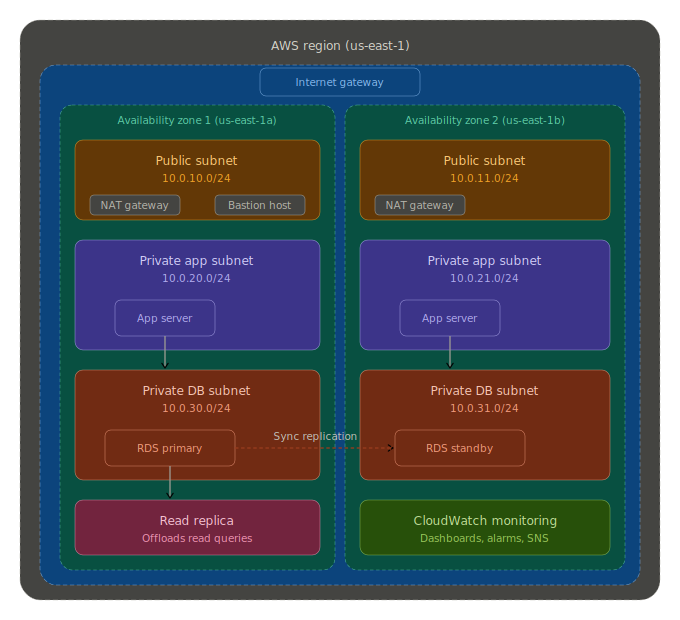

# AWS High-Availability Database Architecture

## Overview

A production-grade, highly available PostgreSQL database deployment on AWS using Terraform. This project demonstrates a Multi-AZ RDS architecture with automatic failover, encrypted storage, read replicas for scaling, and comprehensive CloudWatch monitoring — all deployed as infrastructure-as-code.

The architecture spans multiple Availability Zones to ensure the database remains operational even if an entire AZ goes down, with an RTO (Recovery Time Objective) of approximately 60–120 seconds during automatic failover.

## Architecture



The system is built across three network tiers inside a single VPC:

**Public Tier** — Contains NAT Gateways (one per AZ for redundancy) and a bastion host for administrative SSH access. This is the only tier with internet-facing resources.

**Private Application Tier** — Hosts application servers in isolated subnets. These servers can reach the internet (for updates, external APIs) through the NAT Gateways, but cannot be reached from outside the VPC.

**Private Database Tier** — The most restricted layer. RDS instances live here and only accept connections from the application tier's security group on port 5432. No internet access, no direct SSH.

### Failover Mechanism

AWS RDS Multi-AZ maintains a synchronous standby replica in a different Availability Zone. When a failure is detected (hardware fault, AZ outage, or manual trigger), AWS automatically:

1. Promotes the standby to primary
2. Updates the DNS endpoint (CNAME) to point to the new primary
3. Provisions a new standby in the original AZ once it recovers

Applications using the RDS endpoint experience a brief interruption (typically 60–120 seconds) while DNS propagates. No application-level changes are required — the endpoint stays the same.

### Read Replica

A read replica runs in parallel, receiving asynchronous replication from the primary. It serves two purposes:

- **Read scaling** — Route SELECT-heavy workloads (reports, dashboards, analytics) to the replica endpoint, freeing the primary for writes.
- **Disaster recovery** — In a regional failure scenario, the replica can be manually promoted to a standalone primary.

## Technologies Used

| Technology | Purpose |
|---|---|
| **Terraform** (>= 1.5) | Infrastructure as Code — all resources defined declaratively |
| **AWS VPC** | Network isolation with public/private subnet architecture |
| **AWS RDS (PostgreSQL 15)** | Multi-AZ managed database with automatic failover |
| **AWS KMS** | Encryption at rest with automatic key rotation |
| **AWS CloudWatch** | Monitoring dashboards, metric alarms, and SNS alerting |
| **AWS IAM** | Least-privilege roles for Enhanced Monitoring |
| **Bash / AWS CLI** | Failover simulation and testing automation |

## Infrastructure Setup

### Prerequisites

- AWS CLI v2 configured with credentials that have `AdministratorAccess` (or a scoped policy for RDS, VPC, KMS, CloudWatch, IAM)
- Terraform >= 1.5 installed
- An S3 bucket and DynamoDB table for Terraform remote state (update `backend` block in `vpc.tf`)

### Initial Configuration

1. Clone the repository:

```bash
git clone https://github.com/your-username/aws-ha-database-architecture.git
cd aws-ha-database-architecture/terraform
```

2. Create a `terraform.tfvars` file with your specific values:

```hcl
aws_region         = "us-east-1"
environment        = "production"
vpc_cidr           = "10.0.0.0/16"
availability_zones = ["us-east-1a", "us-east-1b", "us-east-1c"]

db_instance_class  = "db.r6g.large"
db_name            = "appdb"
db_username        = "dbadmin"
db_password        = "CHANGE_ME_USE_SECRETS_MANAGER"

allowed_cidr_blocks = ["YOUR.PUBLIC.IP/32"]
```

> **Important:** Never commit `terraform.tfvars` with real passwords. Use AWS Secrets Manager or SSM Parameter Store in production.

3. Initialize and deploy:

```bash
terraform init
terraform plan -out=tfplan
terraform apply tfplan
```

Deployment takes approximately 15–20 minutes (RDS provisioning is the bottleneck).

## Project Structure

```
aws-ha-database-architecture/
├── terraform/
│   ├── vpc.tf               # VPC, Internet Gateway, NAT Gateways, Elastic IPs
│   ├── subnets.tf           # Public, private app, and private DB subnets + route tables
│   ├── security-groups.tf   # Bastion, application, and database security groups
│   ├── bastion.tf           # Bastion host (SSM Session Manager, optional key pair)
│   └── rds.tf               # Multi-AZ RDS, read replica, KMS, parameter group, IAM
│
├── architecture/
│   └── aws_ha_database_architecture_diagram.svg   # Architecture diagram
│
├── monitoring/
│   └── cloudwatch-dashboard.json # Pre-built CloudWatch dashboard definition
│
├── scripts/
│   └── failover-test.sh     # Automated failover simulation with timing
│
└── README.md
```

**Terraform files** are split by concern rather than lumped into a single `main.tf`. This makes code reviews cleaner and allows teams to own specific layers (e.g., networking team owns `vpc.tf` and `subnets.tf`).

## Deployment Steps

### 1. Deploy Infrastructure

```bash
cd terraform
terraform init
terraform plan
terraform apply
```

### 2. Import the CloudWatch Dashboard

```bash
aws cloudwatch put-dashboard \
  --dashboard-name "rds-ha-monitoring" \
  --dashboard-body file://../monitoring/cloudwatch-dashboard.json \
  --region us-east-1
```

The `--dashboard-body` value **must** use the `file://` prefix so the CLI reads the file. If you run the command from `monitoring/`, use `--dashboard-body file://cloudwatch-dashboard.json` (not `./cloudwatch-dashboard.json`).

from the monitoring directory:
```bash
aws cloudwatch put-dashboard \
  --dashboard-name "rds-ha-monitoring" \
  --dashboard-body file://cloudwatch-dashboard.json \
  --region us-east-1
```
### 3. Verify Connectivity

From the bastion host (or any instance in the app subnet):

```bash
psql -h <primary-endpoint> -U dbadmin -d appdb -c "SELECT version();"
```

### 4. Verify Multi-AZ Status

```bash
aws rds describe-db-instances \
  --db-instance-identifier production-ha-postgresql-primary \
  --query 'DBInstances[0].[MultiAZ,AvailabilityZone,SecondaryAvailabilityZone]' \
  --output table
```

## Testing

### Failover Simulation

The `failover-test.sh` script automates the entire failover test lifecycle:

```bash
cd scripts
chmod +x failover-test.sh
./failover-test.sh --db-identifier production-ha-postgresql-primary --region us-east-1
```

The script will:
- Verify the instance exists and Multi-AZ is enabled
- Record the current Availability Zone
- Trigger a reboot-with-failover via the AWS CLI
- Monitor the instance until it returns to `available`
- Confirm the AZ has changed (proving failover occurred)
- Report total failover duration
- Display recent RDS events for audit

Expected output:

```
[PRE-FAILOVER]  AZ       : us-east-1a
[POST-FAILOVER] AZ       : us-east-1b
[SUCCESS]       AZ changed: us-east-1a → us-east-1b
[TIMING]        Total failover duration: 87 seconds
```

### Connection-Level Testing

For more granular testing, run a connection loop during failover:

```bash
while true; do
  psql -h <endpoint> -U dbadmin -d appdb -c "SELECT now();" 2>&1 | head -1
  sleep 1
done
```

This shows the exact moment connections start failing and when they recover.

## Monitoring

### CloudWatch Dashboard

The pre-built dashboard (`monitoring/cloudwatch-dashboard.json`) tracks 10 key metrics across primary and replica:

| Metric | What It Tells You |
|---|---|
| **CPU Utilization** | Query load and compute pressure (warning at 70%, critical at 90%) |
| **Database Connections** | Active connections vs. max_connections (100 in Terraform parameter group for smaller classes) |
| **Freeable Memory** | Available RAM — drops indicate query pressure or connection bloat |
| **Read/Write Latency** | I/O performance — spikes suggest storage contention |
| **IOPS** | Throughput against provisioned limits |
| **Free Storage Space** | Disk consumption trend — autoscaling kicks in when low |
| **Replica Lag** | How far behind the read replica is (warning at 10s, critical at 30s) |
| **Network Throughput** | Data transfer volume (useful for spotting bulk operations) |
| **Swap Usage** | Should be near zero — any swap indicates memory pressure |

### Recommended Alarms

Set up SNS-based alarms for:

```bash
# CPU > 90% for 5 minutes
aws cloudwatch put-metric-alarm \
  --alarm-name "rds-cpu-critical" \
  --metric-name CPUUtilization \
  --namespace AWS/RDS \
  --dimensions Name=DBInstanceIdentifier,Value=production-ha-postgresql-primary \
  --threshold 90 --comparison-operator GreaterThanThreshold \
  --evaluation-periods 3 --period 300 --statistic Average \
  --alarm-actions arn:aws:sns:us-east-1:ACCOUNT_ID:alerts

# Free storage < 10 GB
aws cloudwatch put-metric-alarm \
  --alarm-name "rds-storage-low" \
  --metric-name FreeStorageSpace \
  --namespace AWS/RDS \
  --dimensions Name=DBInstanceIdentifier,Value=production-ha-postgresql-primary \
  --threshold 10737418240 --comparison-operator LessThanThreshold \
  --evaluation-periods 1 --period 300 --statistic Average \
  --alarm-actions arn:aws:sns:us-east-1:ACCOUNT_ID:alerts
```

## Scaling

### Vertical Scaling

Change `db_instance_class` in `terraform.tfvars` and apply. RDS performs a rolling upgrade with Multi-AZ — the standby is upgraded first, then a failover promotes it, then the old primary is upgraded. Downtime is limited to the failover window (~60–120s).

### Horizontal Read Scaling

Add more read replicas by duplicating the `aws_db_instance.read_replica` resource block with a unique identifier. Each replica gets its own endpoint. Use an application-level read/write split or a connection pooler like PgBouncer to route queries.

### Storage Scaling

Storage autoscaling is enabled (`max_allocated_storage = 500 GB`). RDS automatically expands storage when free space drops below 10% of allocated storage, in increments. No downtime required.

## Cost Considerations

Estimated monthly cost for this architecture (us-east-1, on-demand pricing):

| Resource | Specification | Estimated Monthly Cost |
|---|---|---|
| RDS Primary (Multi-AZ) | db.r6g.large, 100 GB gp3 | ~$380 |
| RDS Read Replica | db.r6g.large, 100 GB gp3 | ~$190 |
| NAT Gateways (x3) | Per-hour + data processing | ~$100–150 |
| KMS Key | 1 key with rotation | ~$1 |
| CloudWatch | Dashboard + Enhanced Monitoring | ~$10–20 |
| **Total** | | **~$680–740/month** |

### Cost Optimization Strategies

- **Reserved Instances** — Commit to 1-year or 3-year terms for 30–60% savings on RDS.
- **Reduce NAT Gateways** — Use 1 NAT Gateway instead of 3 in non-production environments (trades HA for cost).
- **Right-size instances** — Start with `db.t4g.medium` (~$55/month) for dev/staging.
- **Remove the read replica** in environments that don't need read scaling.
- **Use Aurora** — For production at scale, Aurora's storage is cheaper per GB and replication is more efficient, though the compute hourly rate is slightly higher.

## Future Improvements

- **Aurora Migration** — Replace RDS PostgreSQL with Aurora for faster failover (~30s), up to 15 read replicas, and automatic storage scaling to 128 TB.
- **Secrets Manager Integration** — Rotate database credentials automatically instead of storing them in `tfvars`.
- **Terraform Modules** — Refactor into reusable modules (`module "vpc"`, `module "rds"`) for multi-environment deployment.
- **Connection Pooling** — Deploy PgBouncer or RDS Proxy to manage connection overhead and improve failover transparency.
- **Cross-Region Replica** — Add a cross-region read replica for disaster recovery in a secondary AWS region.
- **Automated Backup Testing** — Schedule periodic restores from snapshots to verify backup integrity.
- **CI/CD Pipeline** — Integrate Terraform plan/apply into a Jenkins or GitHub Actions pipeline with approval gates.
